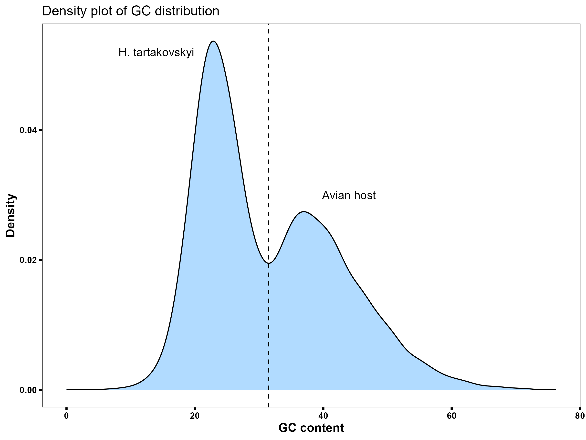
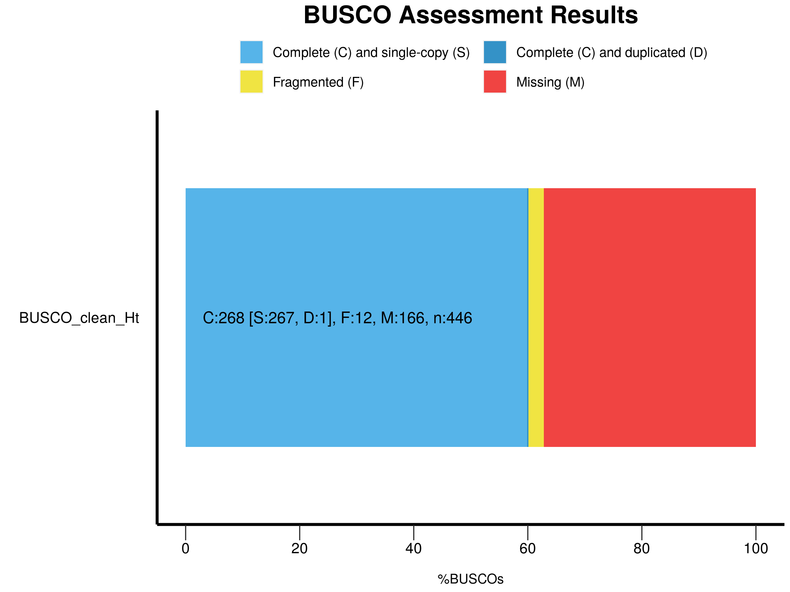
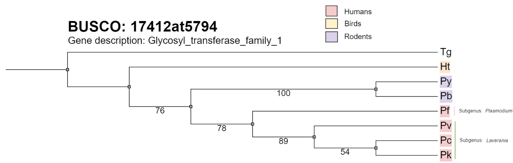
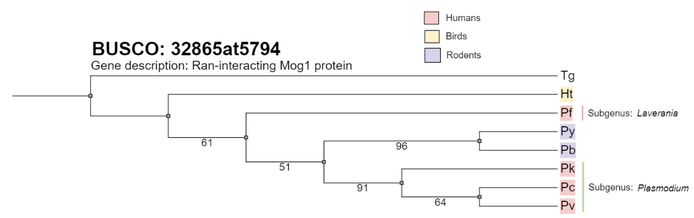

# BINP29 Case Study: The origin of human malaria
Herein, we go back a few years when the origin of _Plasmodium falciparum_ was still not clear. Answers to questions and our workflow/scripts will be added to this `README`.

## Programs used for this analysis
All programs were installed through `mamba` except for `GeneMark-ES`. It was already installed on the server.
```
Program                 Version         Channel

bbmap                   39.06           bioconda
seqkit                  2.7.0           bioconda
GeneMark-ES             4.71            N/A
diamond                 2.1.9           bioconda
taxonkit                0.15.1          bioconda
proteinortho            6.3.1           bioconda
busco                   5.6.1           bioconda
clustalo                1.2.4           bioconda
iqtree                  2.2.6           bioconda
phylip                  3.697           bioconda
```

## Setting the scene
Malaria is a disease caused by parasites within the phylum **Apicomplexa**, with the most prevalent and severe species affecting humans being  **_Plasmodium falciparum_**. However, it is an ongoing debate on the evolution of _P. falciparum_. The main point of contention is whether it is more closely related to other mammalian parasites or if it originated from a bird malaria parasite that changed its host. The genomes of many _Plasmodium_ species have been sequenced, including, notably, the first genome sequence of an avian malaria parasite, **_Haemoproteus tartakovskyi_** (Ht). An extensive phylogenetic analysis may provide answers to this controversy.

### Species and Genomic Information [EDIT]
meta sample info

| Abbr.  | Species                | Host     | Genome Size | Genes | Genomic GC |
|----|----------------------------|----------|-------------|-------|------------|
| Pb | Plasmodium berghei         | rodents  |  17.955 MB  |  7235 |  0.2372    |
| Pc | Plasmodium cynomolgi       | macaques |  26.181 MB  |  5787 |  0.4038    |
| Pf | Plasmodium falciparum      | humans   |  23.270 MB  |  5207 |  0.1936    |
| Pk | Plasmodium knowlesi        | lemurs   |  23.462 MB  |  4952 |  0.3883    |
| Pv | Plasmodium vivax           | humans   |  27.008 MB  |  5682 |  0.4228    |
| Py | Plasmodium yoelii          | rodents  |  22.222 MB  |  4889 |  0.2177    |
| Ht | Haemoproteus tartakovskyi  | birds    |  15.351 MB  |  3343 |  0.2564    |
| Tg | Toxoplasma gondii          | humans   |  128.106 MB | 15892 |  0.5235    |

### What may cause the biased GC-content in some species?
The variation in GC-content among the parasites can be attributed to a combination of evolutionary pressures, host specificity, and the ecological niches these parasites inhabit. It is well documented that obligate symbionts often exhibit reduced genomes and a high AT-content due to their specialized life cycles within host organisms. This specialization can lead to the loss of certain genes, such as those encoding envelope structures, which are not necessary within the protected environment of a host (as seen in endophytic bacteria living within bactericytes). However, this is regarding endophytic bacteria. 

_P. falciparum_ and _P. vivax_ both infect humans but show a big difference in GC-content. This discrepency underscores the concept that, despite infecting the same host species, these parasites have undergone distinct evolutionary trajectories. Likely influenced by immune responses, transmission vectors, and environmental conditions, leading to their current genomic compositions. 

### Do you think that in a phylogenetic tree the parasites that use similar hosts will group together?
Typically, yes, but it's not always straightforward. Especially when considering humans as hosts, it's unlikely they'll cluster neatly. Humans originated in Africa and have since spread globally. Given the potential for host-switching and the diversity of species radiations, it's not a given that Apicomplexa species would necessarily cluster based on their use of similar hosts.
Birds are not geographically set, whereas rodents and primates are mote constrained to their biogeographical setting. Knowing that malaria occurs in Africa and Asia, and that different primates exist there. We might see some interesting results.


## Setting up work directory
### Raw assembly of _H. tartakovskyi_
```
mkdir 00_RAW
ln -s /resources/binp29/Data/malaria/Haemoproteus_tartakovskyi.raw.genome.gz 00_RAW/
```
### Database information
```
mkdir DB
ln -s /resources/binp29/Data/malaria/SwissProt.fasta DB
ln -s /resources/binp29/Data/malaria/uniprot_sprot.dat DB
```
### Existing gene predictions
Other students have already run gene prediction on the _Plasmodium spp._ genomes and _Toxoplasma gondii_ using `gmes_petap.pl` from the GeneMark program (version unknown).

```
# Create directory for gene predictions and soft link them.
mkdir 01_GENEMARK
ln -s /tmp/Prediction/* 01_GENEMARK/
ln -s /resources/binp29/Data/malaria/Tg.gff.gz 01_GENEMARK/
```
### Basic structure
```
.
├── 00_RAW
│   └── Haemoproteus_tartakovskyi.raw.genome.gz -> /resources/binp29/Data/malaria/Haemoproteus_tartakovskyi.raw.genome.gz
├── 01_GENEMARK
│   ├── fixed_Pk.gtf -> /tmp/Prediction/fixed_Pk.gtf
│   ├── genemark.Pb.gtf -> /tmp/Prediction/genemark.Pb.gtf
│   ├── genemark.Pc.gtf -> /tmp/Prediction/genemark.Pc.gtf
│   ├── genemark.Pf.gtf -> /tmp/Prediction/genemark.Pf.gtf
│   ├── genemark.Pk.gtf -> /tmp/Prediction/genemark.Pk.gtf
│   ├── genemark.Pv.gtf -> /tmp/Prediction/genemark.Pv.gtf
│   ├── genemark.Py.gtf -> /tmp/Prediction/genemark.Py.gtf
│   └── Tg.gff.gz -> /resources/binp29/Data/malaria/Tg.gff.gz
├── DB
│   ├── SwissProt.fasta -> /resources/binp29/Data/malaria/SwissProt.fasta
│   ├── taxonomy.dat -> /resources/binp29/Data/malaria/taxonomy.dat
│   └── uniprot_sprot.dat -> /resources/binp29/Data/malaria/uniprot_sprot.dat
└── README.md
```
## Host decontamination of the novel _Haemoproteus tartakovskyi_ assembly.
Both shotgun and paired end sequencing was used to sequence the _H. tartakovskyi_ genome (454 pyroseq). However, as avian blood cells have nuclei there is an abundance of host contamination that has to be delt with. To decontaminate we will use **GC-content** and **contig length** thresholds as the parasite and host GC content is expected to differ. Any contig less than 3000 bp will be removed.

Summary statistics of the **raw_assembly** using `stats.sh`from `bbmap`. We see that we have at least 2750 contigs after hard filtering on 3000 bp length.
```
# Summary statistics
stats.sh 00_RAW/Haemoproteus_tartakovskyi.raw.genome.gz


A       C       G       T       N       IUPAC   Other   GC      GC_stdev
0.3482  0.1407  0.1333  0.3778  0.0000  0.0000  0.0000  0.2740  0.1071

Main genome scaffold total:             15048
Main genome contig total:               15048
Main genome scaffold sequence total:    27.427 MB
Main genome contig sequence total:      27.427 MB       0.000% gap
Main genome scaffold N/L50:             1371/5.219 KB
Main genome contig N/L50:               1371/5.219 KB
Main genome scaffold N/L90:             7572/721
Main genome contig N/L90:               7572/721
Max scaffold length:                    64.494 KB
Max contig length:                      64.494 KB
Number of scaffolds > 50 KB:            1
% main genome in scaffolds > 50 KB:     0.24%


Minimum         Number          Number          Total           Total           Scaffold
Scaffold        of              of              Scaffold        Contig          Contig  
Length          Scaffolds       Contigs         Length          Length          Coverage
--------        --------------  --------------  --------------  --------------  --------
    All                 15,048          15,048      27,426,784      27,426,710   100.00%
     50                 15,048          15,048      27,426,784      27,426,710   100.00%
    100                 15,048          15,048      27,426,784      27,426,710   100.00%
    250                 12,367          12,367      26,974,066      26,973,993   100.00%
    500                  9,767           9,767      26,034,309      26,034,249   100.00%
   1 KB                  5,463           5,463      22,904,063      22,904,026   100.00%
 2.5 KB                  2,750           2,750      18,741,094      18,741,069   100.00%
   5 KB                  1,442           1,442      14,078,731      14,078,713   100.00%
  10 KB                    466             466       7,209,139       7,209,130   100.00%
  25 KB                     33              33       1,033,424       1,033,424   100.00%
  50 KB                      1               1          64,494          64,494   100.00%
```

### GC-distribution
Instead of re-inventing the wheel we will use [seqkit](https://github.com/shenwei356/seqkit) which is a _"ultrafast toolkit for FASTA/Q file manipulation"_. With this tool we can get summary statistics for each contig as well as to apply our filters.
```
mkdir 02_DE-HOST

# Generating a .tsv file with GC% and length for each contig.
seqkit fx2tab --only-id --length --gc --threads 24 --out-file 02_DE-HOST/raw_contig_stats.tsv 00_RAW/Haemoproteus_tartakovskyi.raw.genome.gz

# The contig sequence was included as well, so lets remove the second column
awk '{print $1 "\t" $3 "\t" $4}' 02_DE-HOST/raw_contig_stats.tsv > temp.tsv
mv temp.tsv 02_DE-HOST/raw_contig_stats.tsv

head 02_DE-HOST/raw_contig_stats.tsv 
contig00001     64494   27.77
contig00002     42559   25.90
contig00003     40672   26.60
contig00004     35838   28.12
```
Lets now plot it in `R` using `tidyverse` library.
```
library(tidyverse)

# Read in the data
raw <- read.table("02_DE-HOST/raw_contig_stats.tsv", sep = "\t", header = F)

# Add column names
colnames(raw) <- c("contig", "length", "gc")

# Set custome theme
fig <- theme(
  panel.grid.major = element_blank(),  
  panel.grid.minor = element_blank(),  
  axis.ticks = element_line(size = 1, color = "black"),  
  axis.text.x = element_text(face = "bold", color = "black"),  
  axis.text.y = element_text(face = "bold", color = "black"),  
  axis.title.x = element_text(face = "bold", size = 12),  
  axis.title.y = element_text(face = "bold", size = 12),  
  panel.background = element_blank(),  
  panel.border = element_rect(colour = "black", fill=NA), 
  legend.position = "bottom",
  legend.title = element_blank(),  
  legend.background = element_blank(),  
  legend.key = element_blank(),  
  legend.text = element_text(face = "bold")    
)

# Plot density plot of GC distribution using ggplot
gc_dist <- raw %>% 
  ggplot(aes(x = gc)) +
  geom_density(fill = "steelblue1", colour = "black", alpha = 0.5) +
  labs(title = "Density plot of GC distribution",
       x = "GC content",
       y = "Density") +
  geom_vline(xintercept = 31.5, linetype = "dashed", color = "black") +
  annotate("text", x = 14, y = 0.052, label = "H. tartakovskyi", color = "black", 
           size = 4) +
  annotate("text", x = 44, y = 0.03, label = "Avian host", color = "black", 
           size = 4) +
  theme_bw() +
  fig

# Save the plot as a PNG file
ggsave("figures/gc_dist.png", plot = gc_dist, width = 8, height = 6, units = "in", 
       dpi = 300)
```


We expect **Ht** to have a less GC% than the avian host. Hence, we set the GC threshold as 30 and keep everything that is below.

### Hard Filtering
We had 15048 contigs originally and after filtering we have 2222 contigs with an GC-content of 25.68 % (compared to 27.40 % we had before).
```
# Get the contig ids that meet thresholds.
awk '$2 >= 3000 && $3 < 30 {print $1}' 02_DE-HOST/raw_contig_stats.tsv > 02_DE-HOST/keep_ids.txt

# Generate new fasta using said contig ids.
seqkit grep --threads 24 -f keep_ids.txt 00_RAW/Haemoproteus_tartakovskyi.raw.genome.gz > 02_DE-HOST/tmp.contigs-deHOST.fasta

# Lastly, lets change the headers so we dont have the `length`and `numreads`.
awk '/^>/ {$0=$1} {print}' 02_DE-HOST/tmp.contigs-deHOST.fasta > 02_DE-HOST/contigs-deHOST.fasta

# Remove tmp
rm 02_DE-HOST/tmp.contigs_deHost.fasta
```
Here we see the summary statistics of our decontaminated assembly.
```
> stats.sh 02_DE-HOST/contigs-deHOST.fasta 
 
A       C       G       T       N       IUPAC   Other   GC      GC_stdev
0.3569  0.1321  0.1247  0.3864  0.0000  0.0000  0.0000  0.2568  0.0219

Main genome scaffold total:             2222
Main genome contig total:               2222
Main genome scaffold sequence total:    16.825 MB
Main genome contig sequence total:      16.825 MB       0.000% gap
Main genome scaffold N/L50:             604/8.676 KB
Main genome contig N/L50:               604/8.676 KB
Main genome scaffold N/L90:             1740/3.989 KB
Main genome contig N/L90:               1740/3.989 KB
Max scaffold length:                    64.494 KB
Max contig length:                      64.494 KB
Number of scaffolds > 50 KB:            1
% main genome in scaffolds > 50 KB:     0.38%


Minimum         Number          Number          Total           Total           Scaffold
Scaffold        of              of              Scaffold        Contig          Contig  
Length          Scaffolds       Contigs         Length          Length          Coverage
--------        --------------  --------------  --------------  --------------  --------
    All                  2,222           2,222      16,824,648      16,824,630   100.00%
 2.5 KB                  2,222           2,222      16,824,648      16,824,630   100.00%
   5 KB                  1,374           1,374      13,501,854      13,501,838   100.00%
  10 KB                    451             451       6,996,687       6,996,680   100.00%
  25 KB                     33              33       1,033,424       1,033,424   100.00%
  50 KB                      1               1          64,494          64,494   100.00%
```
## Host-Decontamination using `DIAMOND` and `Swissprot`
To make sure we do not have any more host contamination we will use `DIAMOND` and `diamond_add_taxonomy` to classify our contigs based of the alignments against the `Swissprot` database. However, we first need to predict genes!

### Why?
Our hard filtering removed what we expect to be biologically irrelevent (small contig size) and contigs we expect to be avian based on GC-content. To increase our confidence we can utilize the annotated databases. Specifically, we want to use protein databases and not **genome**. Genomes would be a very computational heavy process, while proteins will be less as the sequences are smaller.
Thus, we need to use `GeneMark-ES` to predict genes that we then can use to BLAST against a protein database. In our case we will be using the high-quality and well annotated protein database: `Swissprot`.

### Gene prediction using `GeneMark`
We found 11228 CDS and 3683 genes !
```
mkdir 03_GENE-PRED

# Gene prediction
gmes_petap.pl --ES --min_contig 3000 --cores 24 --work_dir 03_GENE-PRED/ --sequence 02_DE-HOST/contigs-deHOST.fasta

# Lets check what GeneMark found.
cat 03_GENE-PRED/genemark.gtf | cut -f3 | sort | uniq -c

  11228 CDS
   3683 gene
   7545 intron
   3683 mRNA
   2098 start_codon
   2645 stop_codon
``` 

#### Generate FASTA file from .gtf
Here we will use the `gffParse.pl` script to generate FASTA files from the .gft file from the last step. The script can be found in `scripts/`.

```
# Generate .fna and .faa files for gene features
gffParse.pl -i 02_DE-HOST/contigs-deHOST.fasta -g 03_GENE-PRED/genemark.gtf -b Ht_gene -d 04_GENE/ -p -f gene
```

### DIAMOND
`DIAMOND` is an accelerated version of BLASTX, capable of performing the same alignments 20000 times faster. 

#### Get the NCBI taxonomy.
As i want to work with the taxonomy i will download the NCBI taxdump and
taxonomy map (protein accesion -> taxid).

```
# Download taxdump
wget -c ftp://ftp.ncbi.nih.gov/pub/taxonomy/taxdump.tar.gz 

# Unpack it to specific directory in DB/taxdump
mkdir DB/NCBI_TAXDUMP
tar -zxvf taxdump.tar.gz -C DB/NCBI_TAXDUMP

# Remove the .tar.gz
rm taxdump.tar.gz

# Download the taxonmap
wget ftp://ftp.ncbi.nlm.nih.gov/pub/taxonomy/accession2taxid/prot.accession2taxid.gz

# Unzip to NCBI_TAXDUMP
gunzip -c prot.accession2taxid.gz > DB/NCBI_TAXDUMP/prot.accession2taxid

```

#### Creating the `DIAMOND` database.

```
# Creating the database
diamond makedb --threads 24 \ 
    --in DB/SwissProt.fasta \ 
    --db DB/diamond_swissprot \ 
    --taxonmap DB/NCBI_TAXDUMP/prot.accession2taxid \ 
    --taxonnodes DB/NCBI_TAXDUMP/nodes.dmp \ 
    --taxonnames DB/NCBI_TAXDUMP/names.dmp

```
#### Running DIAMON
Lets run both **blastp** and **blastx** as we got both `.fna` and `.faa` files from the `gffParser.pl`.

Using the `time` command we saw that `DIAMOND` took: 
- **BLASTP** : `real    0m14.988s`. 

- **BLASTX**: `real    0m17.327s`

Furthermore, we got **19110** alignments with blastp and **30085** with blastx.

This is how we structured the tabulated .out file.

1. **qseqid**: Query ID.

2. **sphylums sscinames staxids**: Phylum, Scientific name, NCBI taxid.

3. **sseqid**: The sequence it matched to in Swissprot DB.

4. **qlen evalue bitscore pident**: Query length, then BLAST satistics.

The meaning of the flags
- `--sensitive`: Enable the sensitive mode designed for full sensitivity for hits >40% identity.

- `--evalue`: E-value threshold.

- `--outfmt 6`: Specifies we want it in tabular format with the column structure mentioned above.

-`--max-target-seqs 10`: Only reports the top 10 based on evalue.

```
# BLASTp
diamond blastp \
    --threads 36 --sensitive --evalue 0.001 \
    --db DB/diamond_swissprot.dmnd \
    --query 04_Ht-GENE/Ht_gene.faa \ 
    --outfmt 6 qseqid sphylums sscinames staxids sseqid qlen evalue bitscore pident \
    --max-target-seqs 10 \
    --out 05_DIAMOND/bp-Ht.out

# BLASTx
diamond blastx \
    --threads 36 --sensitive --evalue 0.001 \
    --db DB/diamond_swissprot.dmnd \
    --query 04_Ht-GENE/Ht_gene.fna \ 
    --outfmt 6 qseqid sphylums sscinames staxids sseqid qlen evalue bitscore pident \
    --max-target-seqs 10 \
    --out 05_DIAMOND/bx-Ht.out
```

### Taxonomy parsing
We will be using `TaxonKit` instead of parsing.

#### Determining which `taxids` belong to the order Aves
First, lets generate a file with all the unique taxids from our diamond output.

```
# Generate a file with taxids
cat 05_DIAMOND/bx-Ht.out | cut -f4 | sort | uniq > 05_DIAMOND/bx-Ht.tax
cat 05_DIAMOND/bp-Ht.out | cut -f4 | sort | uniq > 05_DIAMOND/bp-Ht.tax
```

Now lets see which taxids belong to the order Aves.
```
# Set variable for TaxonKit
TAXONKIT_DB="DB/NCBI_TAXDUMP/"

# BLASTp hits
taxonkit lineage -n --data-dir $TAXONKIT_DB -n 05_DIAMOND/bp-Ht.tax | grep "Aves" | cut -f 1,3

# BLASTx hits
taxonkit lineage -n --data-dir $TAXONKIT_DB -n 05_DIAMOND/bx-Ht.tax | grep "Aves" | cut -f 1,3
```

The same taxids are found. 
```
59729   Taeniopygia guttata
8932    Columba livia
9031    Gallus gallus
9091    Coturnix coturnix
93934   Coturnix japonica
```

#### To remove or not to remove contigs
Lets determine which contigs had the bird genes and determine if the alignments are significant enough.

```
# Save the taxids to a .txt
taxonkit lineage -n --data-dir $TAXONKIT_DB -n 05_DIAMOND/bx-Ht.tax | grep "Aves" | cut -f 1 > 05_DIAMOND/taxid_aves.txt
```

Now lets parse to get the contigs and alignment scores.
```
mkdir 06_AVES-OUT

# BLASTp hits
cat 05_DIAMOND/bp-Ht.out | grep -w -f 05_DIAMOND/taxid_aves.txt | cut -f 1,3,4,5,6,7,8,9 > 06_AVES-OUT/tmp.bp-Ht-aves.out

# BLASTx hits
cat 05_DIAMOND/bx-Ht.out | grep -w -f 05_DIAMOND/taxid_aves.txt | cut -f 1,3,4,5,6,7,8,9 > 06_AVES-OUT/tmp.bx-Ht-aves.out
```
Then lets fix the id to only keep the contig name
```
# BLASTp hits
awk -F'\t' 'BEGIN {OFS="\t"} {split($1,a,"="); $1=a[3]; print}' 06_AVES-OUT/tmp.bp-Ht-aves.out | sed 's/\\tstrand//' > bp-Ht-aves.out

# BLASTx hits
awk -F'\t' 'BEGIN {OFS="\t"} {split($1,a,"="); $1=a[3]; print}' 06_AVES-OUT/tmp.bp-Ht-aves.out | sed 's/\\tstrand//' > bx-Ht-aves.out

# Remove the tmp files.
rm 06_AVES-OUT/tmp.*
```
Inspecting the `aves.out` files we see that the evalues are very significant. 
Also, we get the same contigs for both blastp and blastx.

```
# BLASTp
cat 06_AVES-OUT/bp-Ht-aves.out | cut -f1 | sort | uniq | wc -l
125
# BLASTx
cat 06_AVES-OUT/bx-Ht-aves.out | cut -f1 | sort | uniq | wc -l
125

# Concatenated
cat 06_AVES-OUT/bx-Ht-aves.out | cut -f1 > 06_AVES-OUT/aves-contigs.txt
cat 06_AVES-OUT/bp-Ht-aves.out | cut -f1 >> 06_AVES-OUT/aves-contigs.txt
cat 06_AVES-OUT/aves-contigs.txt | sort | uniq | wc -l
125

```
Therefore, i will remove all the 125 contigs.

### Removing Host contamination

```
mkdir 07_CLEAN

# Getting all contigs except those in aves-contigs.txt
seqkit grep -v -f 06_AVES-OUT/aves-contigs.txt 02_DE-HOST/contigs-deHOST.fasta > 07_CLEAN/clean_Ht.fasta
```
Using `stats.sh` again from `bbmap` we get these results of our final clean assembly.
```
A       C       G       T       N       IUPAC   Other   GC      GC_stdev
0.3566  0.1320  0.1244  0.3871  0.0000  0.0000  0.0000  0.2564  0.0221

Main genome scaffold total:             2097
Main genome contig total:               2097
Main genome scaffold sequence total:    15.351 MB
Main genome contig sequence total:      15.351 MB       0.000% gap
Main genome scaffold N/L50:             583/8.297 KB
Main genome contig N/L50:               583/8.297 KB
Main genome scaffold N/L90:             1652/3.904 KB
Main genome contig N/L90:               1652/3.904 KB
Max scaffold length:                    64.494 KB
Max contig length:                      64.494 KB
Number of scaffolds > 50 KB:            1
% main genome in scaffolds > 50 KB:     0.42%


Minimum         Number          Number          Total           Total           Scaffold
Scaffold        of              of              Scaffold        Contig          Contig  
Length          Scaffolds       Contigs         Length          Length          Coverage
--------        --------------  --------------  --------------  --------------  --------
    All                  2,097           2,097      15,351,229      15,351,214   100.00%
 2.5 KB                  2,097           2,097      15,351,229      15,351,214   100.00%
   5 KB                  1,273           1,273      12,131,676      12,131,663   100.00%
  10 KB                    394             394       5,962,061       5,962,057   100.00%
  25 KB                     25              25         785,970         785,970   100.00%
  50 KB                      1               1          64,494          64,494   100.00%
```
### BUSCO check
To get an idea of how complete the assembly is we will run `BUSCO` using the [apicomplexa_odb10](https://busco.ezlab.org/list_of_lineages.html) database.

Our host decontamination seems to have worked well as we only have one duplicated single copy gene. However, we are missing quite the chunk.

```
mkdir 08_BUSCO/

# Run BUSCO
busco -i 07_CLEAN/clean_Ht.fasta -m genome -c 64 --out_path 08_BUSCO/ -l apicomplexa_odb10

2024-02-29 15:07:50 INFO:

    ---------------------------------------------------
    |Results from dataset apicomplexa_odb10            |
    ---------------------------------------------------
    |C:60.1%[S:59.9%,D:0.2%],F:2.7%,M:37.2%,n:446      |
    |268    Complete BUSCOs (C)                        |
    |267    Complete and single-copy BUSCOs (S)        |
    |1    Complete and duplicated BUSCOs (D)           |
    |12    Fragmented BUSCOs (F)                       |
    |166    Missing BUSCOs (M)                         |
    |446    Total BUSCO groups searched                |
    ---------------------------------------------------

# Generating plots
generate_plot.py -wd 05_BUSCO/BUSCO_assembly.fasta/
```


## Gene prediction on clean Ht assembly
Time to make new gene predictions but using the decontaminated assembly.

```
mkdir 09_CLEAN-GENES/

# Gene pred
gmes_petap.pl --ES --min_contig 3000 --cores 64 --work_dir 09_CLEAN-GENES/ --sequence 07_CLEAN/clean_Ht.fasta
```

## Orthologous genes
To compare the phylogeny we need to determine genes that are present in all taxa and that are somewhat conserved. In essence, we need orthologous genes.

### FASTA files with genes from each genome
We need to generate `.faa` files for each genome with their corresponding genes. However, as `Tg.gff.gz` doesnt have any `gene` annotations we will use the default `CDS`. Furtheremore, the soft link for `Tg.gff.gz` will be removed and the file will be copied to `01_GENEMARK` and `gunzipped`.
This means that the `00_RAW/` files also have to be `gunzipped`.

Finally, `Plasmodium_knowlesi.genome` has duplicated headers. We will start by fixing it.

```
# Remove the lines that start with chromosome
cat 00_RAW/Plasmodium_knowlesi.genome | grep -v "^chromosome" > 00_RAW/tmp.Plasmodium_knowlesi.genome

# Remove and change name of the tmp file.
rm 00_RAW/Plasmodium_knowlesi.genome
mv 00_RAW/tmp.Plasmodium_knowlesi.genome 00_RAW/Plasmodium_knowlesi.genome
```

_samples.csv_
```
Ht,07_CLEAN/clean_Ht.fasta,09_CLEAN-GENES/genemark.gtf
Pb,00_RAW/Plasmodium_berghei.genome,01_GENEMARK/genemark.Pb.gtf
Pc,00_RAW/Plasmodium_cynomolgi.genome,01_GENEMARK/genemark.Pc.gtf
Pf,00_RAW/Plasmodium_faciparum.genome,01_GENEMARK/genemark.Pf.gtf
Pk,00_RAW/Plasmodium_knowlesi.genome,01_GENEMARK/genemark.Pk.gtf
Pv,00_RAW/Plasmodium_vivax.genome,01_GENEMARK/genemark.Pv.gtf
Py,00_RAW/Plasmodium_yoelii.genome,01_GENEMARK/genemark.Py.gtf
Tg,00_RAW/Toxoplasma_gondii.genome,01_GENEMARK/Tg.gff
```

_gene_fasta_parser.sh_
```{bash}
#!/bin/bash

# Make directory for FASTA-GENES, if it doesn't already exist
mkdir -p 10_FASTA-GENES

# Change to the 10_FASTA-GENES directory
cd 10_FASTA-GENES

# Loop through samples.csv and run gffParse.pl for each line
while IFS=, read -r taxa genome gff; do
  # Run parser for each genome
  gffParse.pl -c -i ../"$genome" -g ../"$gff" -b ../"$taxa" -d "$taxa" -p -f CDS
done < ../samples.csv

# Change back to the original directory
cd ..
```
### Renaming headers and removing stopcodons (*)
The headers have a bit of information that is not needed. The sequences also have stop codons indicated with an asterix (*).

Lets fix that

*clean_header.sh*
```
#!/bin/bash

# Set directory
dir="10_FASTA-GENES"

for taxa in Ht Pb Pc Pf Pk Pv Py Tg; do
  fix="_$taxa"

  # Rename to raw.
  mv ${dir}/${taxa}.faa ${dir}/raw-${taxa}.faa

  # Fix header to keep gene number and taxa, and remove asterisks.
  awk -v fix="$fix" '/^>/ {print $1 fix; next} {print}' ${dir}/raw-${taxa}.faa | \
    sed 's/\*//g' > ${dir}/${taxa}-clean.faa

done
```

### ProteinOrtho
We will use `Proteinortho` to find orthologous genes!

```
# Generate directory and move to it as output cant be specified.
mkdir 11_PROT-ORTHO
cd 11_PROT-ORTHO

# Call proteinortho to find orthologs using brace expansion.
proteinortho6.pl -project=Ht_phylo ../10_FASTA-GENES/{Ht,Pb,Pc,Pf,Pk,Pv,Py,Tg}-clean.faa

# Move back
cd ..
```

### BUSCO
How many of the predicted genes are BUSCO orthologs.
```
#!/bin/bash

# Set directory
dir="10_FASTA-GENES"

# Create directory if it doesnt exist
mkdir -p 12_BUSCO-ORTHO

for taxa in Ht Pb Pc Pf Pk Pv Py Tg; do

  busco -i $dir/$taxa-clean.faa -m prot -c 64 \
          --out_path 12_BUSCO-ORTHO -l apicomplexa_odb10

done
```
We see that our genes that were predicted are not as complete as the other taxa. It is interesting that the completeness has reduced 10% compared to when we ran BUSCO on the whole Ht genome. The gene predictor seems to have missed 40 genes. 

As noted in the previous BUSCO run, our genome is missing 40% of the BUSCOs, which indicates that our assembly is not optimal. Perhaps the sequence depth was not enough or data was lost prior the assembly (as we do not have the raw reads).
| Taxa | Numb. Complete BUSCOs | Percentage Completeness |
|----  |----------|-------------|
| Pb   | 361      |  81.0       |
| Pc   | 429      |  96.2       |
| Pf   | 436      |  97.8       |
| Pk   | 433      |  97.1       |
| Pv   | 437      |  97.9       |
| Py   | 435      |  97.5       |
| Ht   | 228      |  51.1       |
| Tg   | 381      |  85.5       |

#### Which BUSCOs do they share?
The BUSCO id's for each `$taxa` can be found here:

    12_BUSCO-ORTHO/BUSCO_$taxa-clean.faa/run_apicomplexa_odb10/full_table.tsv

So lets parse and see which they share!

*get_busco_id.sh*
```
#!/bin/bash

tsv="run_apicomplexa_odb10/full_table.tsv"
for taxa in Ht Pb Pc Pf Pk Pv Py Tg; do

cat 12_BUSCO-ORTHO/BUSCO_$taxa-clean.faa/$tsv | grep -w "Complete" | \
 cut -f 1 >> 12_BUSCO-ORTHO/all_BUSCO-ID.txt

done
```
Apparently, they share **0** orthologous genes across all species. However, there seems that 190 BUSCO genes are shared across 7 of the species.

```
cat 12_BUSCO-ORTHO/all_BUSCO-ID.txt | sort | uniq -c | grep -c -w "8" 
0

cat 12_BUSCO-ORTHO/all_BUSCO-ID.txt | sort | uniq -c | grep -c -w "7" 
190
```
Lets edit the script to remove _Toxoplasma gondii_.

*no_Tg_BUSCO_ids.sh*
```
#!/bin/bash

tsv="run_apicomplexa_odb10/full_table.tsv"
for taxa in Ht Pb Pc Pf Pk Pv Py; do

cat 12_BUSCO-ORTHO/BUSCO_$taxa-clean.faa/$tsv | grep -w "Complete" | \
 cut -f 1 >> 12_BUSCO-ORTHO/no-Tg_BUSCO-ID.txt

done

numb=$(cat 12_BUSCO-ORTHO/no-Tg_BUSCO-ID.txt | sort | uniq -c | grep -c -w "7")

echo "  Number of orthologous genes shared: $numb"
```

```
bash scripts/no_Tg_BUSCO_ids.sh
  Number of orthologous genes shared: 188
```

Eureeeka! It seems that the outgroup **Tg** is to far off. Which, is a bit peculiar as all our species comes from the same Phylum (Apicomplexa). However, _Plasmodium spp._ and _Haemoproteus spp._ belong in the class **Aconoidasida** whereas **Tg** belongs to **Conoidasida**. 

As mentioned in the beginning of this `README`, endophytes have strong selective pressure due to thier life cycle. The rate of evolutionary change and divergence is concordingly much faster which results with them being so divergent. Noteworthy, if we had relaxed the thresholds of BUSCO we could probably have achieved orthologous genes between them all. 

When i include fragmented hits for **Tg** we do find 10 orthologous genes.

```
# Get fragmented
cat 12_BUSCO-ORTHO/BUSCO_Tg-clean.faa/run_apicomplexa_odb10/full_table.tsv | grep "Fragmented" | cut -f1 > 12_BUSCO-ORTHO/Tg_frag.txt

# Append all the BUSCOS
cat 12_BUSCO-ORTHO/all_BUSCO-ID.txt >> 12_BUSCO-ORTHO/Tg_frag.txt

# Which BUSCO ids have 8 counts.
cat Tg_frag.txt | sort | uniq -c | grep -w "8" 
      8 11034at5794
      8 13789at5794
      8 17412at5794
      8 19039at5794
      8 22083at5794
      8 24759at5794
      8 25958at5794
      8 27384at5794
      8 32865at5794
      8 3730at5794
```

Lets check which genes these are.

```
# Store these orthologs
cat Tg_frag.txt | sort | uniq -c | grep -w "8" | awk '{print $2}' > 12_BUSCO-ORTHO/ALL-SHARE-ORTHO.txt

# Lets get the names
cat 12_BUSCO-ORTHO/BUSCO_Tg-clean.faa/run_apicomplexa_odb10/full_table.tsv | grep -f ALL-SHARE-ORTHO.txt | cut -f1,7

  3730at5794      Radical SAM
  11034at5794     Glycylpeptide N-tetradecanoyltransferase
  13789at5794     ATPase, V1 complex, subunit H
  17412at5794     Glycosyl transferase, family 1
  19039at5794     Ribonuclease
  22083at5794     TATA-box binding protein
  24759at5794     tRNA (adenine(58)-N(1))-methyltransferase
  25958at5794     Uracil-DNA glycosylase
  27384at5794     Dim1 family
  32865at5794     Ran-interacting Mog1 protein
```
Without prior knowledge ATpase, Ribonuclease, TATA-box and tRNA sure does sound like important genes to conserve. Lets use these 10 to generate a phylogenetic tree!

#### Generating FASTA files for each BUSCO
We have the shared BUSCO IDs, and with the `full_table.tsv` we can get the corresponding contigs.

*phylo_fasta.sh*
```
#!/bin/bash

phylo="13_PHYLO-FASTA"
dir="12_BUSCO-ORTHO"
tsv="run_apicomplexa_odb10/full_table.tsv"

mkdir -p $phylo

# Read through the BUSCO IDs
while read -r id; do

  # Append each sequence record for each taxa to BUSCO ID fasta file.
  for taxa in Ht Pb Pc Pf Pk Pv Py Tg; do

    # Get the header
    header=$(cat $dir/BUSCO_$taxa-clean.faa/$tsv | grep $id | cut -f3)
    
    # Get name of gene without whitespace or other special characters
    name=$(cat $dir/BUSCO_$taxa-clean.faa/$tsv | grep $id | cut -f7 | \
      tr " " "_" | sed "s/[,()]//g")

    fasta="10_FASTA-GENES/$taxa-clean.faa"

    # Append the fasta record (header + sequence)
    cat $fasta | grep -A 1 -w "^>$header" >> "${phylo}/${id}_${name}.faa"
  
  done
done < $dir/ALL-SHARE-ORTHO.txt
```
The result after running `phylo_fasta.sh`!

```
13_PHYLO-FASTA/
├── 11034at5794_Glycylpeptide_N-tetradecanoyltransferase.faa
├── 13789at5794_ATPase,_V1_complex,_subunit_H.faa
├── 17412at5794_Glycosyl_transferase,_family_1.faa
├── 19039at5794_Ribonuclease.faa
├── 22083at5794_TATA-box_binding_protein.faa
├── 24759at5794_tRNA_adenine58-N1-methyltransferase.faa
├── 25958at5794_Uracil-DNA_glycosylase.faa
├── 27384at5794_Dim1_family.faa
├── 32865at5794_Ran-interacting_Mog1_protein.faa
└── 3730at5794_Radical_SAM.faa
```

## Phylogenetic analysis
First we will align using Clustal Omega (`clustalo`) then generate trees with `iqtree`.

*clustalo_run.sh* 
```
#!/bin/bash

mkdir -p 14_PHYLO-ALIGN

# Loop through each file in 13_PHYLO-FASTA directory
for file in 13_PHYLO-FASTA/*; do
  # Extract the filename without the path and cut on '_'
  short_name=$(basename "$file" | cut -d "_" -f1,2)
  
  # Align
  clustalo -i "$file" -o "14_PHYLO-ALIGN/${short_name}-align.faa" --auto
done

```

We will use a MODE-FINDEr by using `-m MFP` which means for `Extended model selection followed by tree inference`. Furthermore, we will do a 1000 bootstraps.
*iqtree_run.sh*
```
#!/bin/bash

mkdir -p 15_IQTREE/
cd 15_IQTREE/

# Loop through each file
for file in ../14_PHYLO-ALIGN/*; do
  # Extract the filename without the path and cut on '_'
  short_name=$(basename "$file" | cut -d "-" -f1)
  
  mkdir -p $short_name
  
  # Model
  iqtree2 -nt 32 -s $file -m MFP -B 1000 --prefix ${short_name}/${short_name}
done
```
After running and investigating the trees, we find these two to be the best scored. The other trees had either similar structure (but less score) or very different.

_Best scoring tree_


_Similar to-date phylogeny: [10.1186/s12936-022-04130-9](https://malariajournal.biomedcentral.com/articles/10.1186/s12936-022-04130-9)_



### Lets use our 10 trees to generate a consensus
We will use `phylip` to generate this.

First lets put all trees into one file.
```
mkdir -p 16_CONSENSUS-TREE

# Copy all files to new directory
find ~/02_binp29/BINP29_Malaria/15_IQTREE/ -type f -name "*.contree" -exec cp {} 16_CONSENSUS-TREES/ \;

# Concatenate them to one tree.
cat 16_CONSENSUS-TREES/* > 16_CONSENSUS-TREES/ALL-TREES.contree

# Fix names to only have species.
sed 's/[0-9]*_g_//g' 16_CONSENSUS-TREES/ALL-TREES.contree > 16_CONSENSUS-TREES/FIXED-ALL-TREES.contree
```

Then we run `phylip consense` and follow the instructions.
It generates two files, `outfile` and `outtree`

_outfile_
```

                          +---------------Pf
                  +--2.00-|
                  |       |       +-------Pb
                  |       +--10.0-|
          +--5.00-|               +-------Py
          |       |
          |       |               +-------Pc
          |       |       +--4.00-|
  +-------|       +--9.00-|       +-------Pv
  |       |               |
  |       |               +---------------Pk
  |       |
  |       +-------------------------------Tg
  |
  +---------------------------------------Ht
```